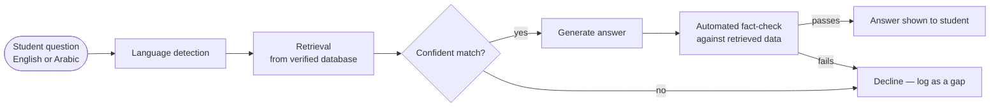
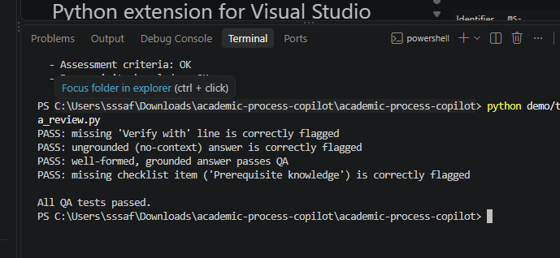
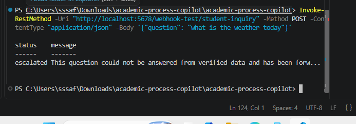
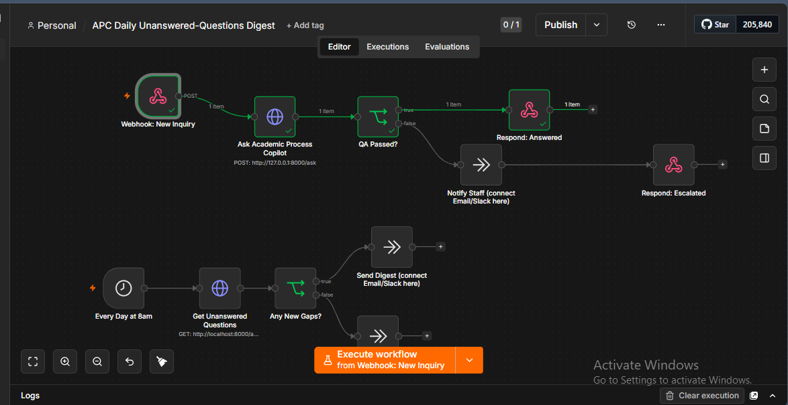
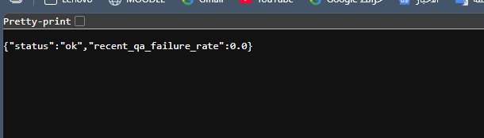

# Academic Process Copilot

An AI-assisted institutional process assistant: a student asks a question
about a university procedure — in English or Arabic — and the system
answers from a verified, article-cited database, guides them through the
required steps, and **refuses to guess** when the data doesn't cover the
question.

Built end-to-end as a working prototype: a bilingual retrieval-and-answer
engine, a documented REST API, a real no-code automation layer, and an
automated test suite — not a mockup or a slide deck.

> **This repository is a public summary.** The full implementation
> (source code, test suite, and internal technical documentation) is
> maintained in a private repository while this project moves from
> prototype toward a product. I'm happy to walk through the code live in
> a technical interview, or share access under a short NDA — see
> [Contact](#contact).

## What it does

- Answers real university-regulation questions (registration, course
  withdrawal, academic probation, deferral, graduation requirements, and
  more) from a verified, article-cited database — not a general-purpose
  language model guessing from training data.
- Answers **in the language the question was asked in** — English or
  Arabic — including common informal Arabic spelling variants.
- **Declines to answer** when the data doesn't clearly support a
  confident match, rather than returning a plausible-sounding guess.
  Getting this right — and proving it, not just claiming it — was most
  of the engineering effort; it's covered by a dedicated automated test
  suite.
- Every generated answer is automatically checked against the data it
  was retrieved from before being shown to the user, to prevent
  hallucinated facts (invented numbers, invented citations).
- Closes its own knowledge gaps: unanswered questions are logged,
  grouped by frequency, and surfaced to staff, who can add a verified
  answer without touching the rest of the system.

## Tech stack

Python · FastAPI · SQLite · Docker · GitHub Actions (CI) · n8n
(no-code workflow automation) · sparse (BM25) retrieval with a
custom confidence-gating layer · rule-based Arabic text normalization

## Architecture (high level)

The exact retrieval-scoring and confidence-gating logic — including two
real edge cases found and fixed during development — is documented in
the private repository and demonstrated on request.

## Evidence it actually works

Screenshots below are from the real system running, not mockups.

**Automated tests passing**, including a test specifically designed to
fail (a deliberately broken answer) actually failing — proving the
quality-assurance layer catches bad output, not just that it exists:

**The no-code automation layer correctly declining** a question outside
the system's data instead of guessing:

**Both automation workflows executing successfully** in one run:

**The service's health endpoint**, live:

## Testing rigor

9 automated test suites (run on every code change via CI), covering:
retrieval accuracy on ambiguous questions, bilingual correctness,
a proof that offline-mode answers cannot contain invented information,
API authentication and rate limiting, and PII handling. Test file names
and what each proves are listed in the private repository.

## Status

Active prototype, in the process of being developed into a product for
institutional use. Core engineering (retrieval, bilingual support,
anti-hallucination checks, security hardening, a deployable API and a
student-facing interface) is built and tested; I'm currently working
through pilot conversations before any public deployment.

## Contact

Safa Mohammed Al Shukaili
[LinkedIn](https://linkedin.com/in/safa-mohammed-alshukaili-1b4a9b267) ·
[GitHub](https://github.com/Safa-Alshukaili) ·
mohammedsafa500@gmail.com
